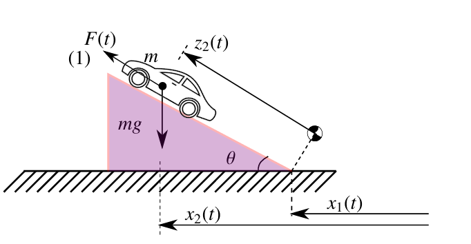

# Longitudinal Vehicle Control — Cruise Control Simulation

> **DAS5109 — Modelagem e Simulação de Processos | UFSC**

Modelagem matemática e simulação do controle longitudinal de um **Honda Civic Si 2008** com controlador **PI e agendamento de ganho**, implementado no MATLAB/Simulink.

---

## Modelo Dinâmico



Aplicando a 2ª Lei de Newton na direção longitudinal:

$$m\dot{v} = F(t) - bv - cv^2 - mg\sin(\theta)$$

Linearizada em torno de uma velocidade de cruzeiro $v_0$, a função de transferência é:

$$G(s) = \frac{K}{\tau s + 1}, \quad K = \frac{1}{b + 2cv_0}, \quad \tau = \frac{m}{b + 2cv_0}$$

### Parâmetros do Veículo

| Parâmetro | Valor | Unidade |
|---|---|---|
| Massa (m) | 1322 | kg |
| Área frontal (A) | 2.16 | m² |
| Coef. de arrasto (cd) | 0.29 | — |
| Potência máxima | 192 cv | W |
| Velocidade máxima | 215 | km/h |

---

## Controlador PI

$$C(s) = K_p + \frac{K_i}{s}$$

Um **filtro de referência** cancela o zero da malha fechada, resultando em resposta de 2ª ordem sem sobressinal:

$$H_f(s) = \frac{K_i}{K_p s + K_i}$$

### Agendamento de Ganho

Os ganhos são ajustados em tempo real conforme a velocidade de operação:

| Velocidade | $K_p$ | $K_i$ |
|---|---|---|
| 50 km/h | 501.46 | 52.88 |
| 100 km/h | 490.80 | 52.88 |
| 150 km/h | 480.14 | 52.88 |
| 200 km/h | 469.49 | 52.88 |

---

## Resultados

| Cenário | Resultado |
|---|---|
| Malha aberta | 0 → 100 km/h em ~8 s (consistente com ficha técnica Honda) |
| Malha fechada | 0 → 100 km/h em ~28 s com aceleração suave |
| Rejeição de perturbação | Retorno à referência após rampa de inclinação aplicada aos 40 s |

---

## Arquivos

| Arquivo | Descrição |
|---|---|
| `vehicle_longitudinal_openloop.m` | Parametrização do modelo e execução da simulação |
| `vehicle_longitudinal_openloop.slx` | Modelo Simulink (malha aberta e fechada com controlador PI) |

---

## Como Usar

**Requisitos:** MATLAB R2020b+ com Simulink

```matlab
% No MATLAB, basta executar:
vehicle_longitudinal_openloop
```

O script parametriza o modelo, executa a simulação no Simulink e plota velocidade × tempo.

---

## Autores

**Marina Grisotti & Gustavo Mattos**  
Universidade Federal de Santa Catarina — Departamento de Automação e Sistemas

Orientador: Prof. Marcelo de Lellis Costa de Oliveira  
Disciplina: DAS5109 — Modelagem e Simulação de Processos
